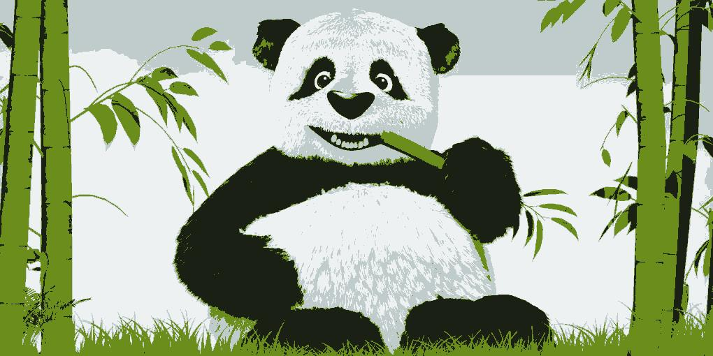

# Image Color Compressor

Applies a basic K-Means algorithm to reduce the no. of colors used by the image.  
The author personally likes these new images that are produced and they look like sketches.

------------

Input:  

Corresp- Output:  

------------

Input:  

Corresp- Output:  

------------

Input:  

Corresp- Output:  

------------
 
Input:  

Corresp- Output:  

------------

Input:  

Corresp- Output:  

